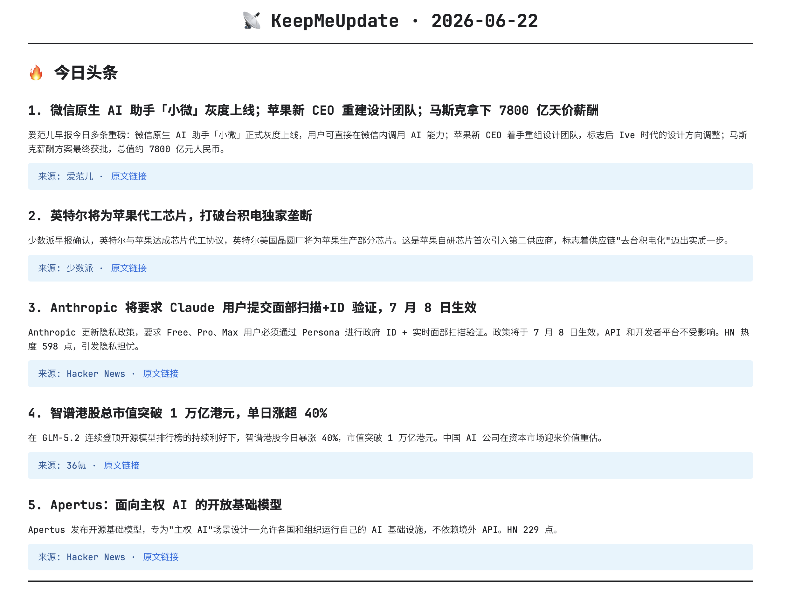

# 📡 KeepMeUpdate

> **Daily tech/AI/geek news digest powered by RSS + web search.**  
> 基于 RSS 和网络搜索的每日科技/AI/极客新闻摘要。  
> *A skill for [Hermes Agent](https://hermes-agent.nousresearch.com).*



---

## What / 这是什么

KeepMeUpdate 是一个 Hermes Agent skill。触发后它会：

1. 先跟你聊 4 个问题（语言、时区、输出方式、RSS 源），把配置存到本地
2. 从你的 RSS 源抓取最新文章
3. 用 web search 补充当日热点
4. AI 筛选、去重、分类、写导读
5. 终端输出或写入本地 Markdown 文件

**核心原则：信息够新、够前沿。** 不依赖任何 API key，纯 Python 标准库。

> ⚠️ 这是一个 **AI agent skill** —— 不是独立 CLI 工具。需要 Hermes Agent 或其他支持 SKILL.md 协议的 agent 来驱动。

---

## Quick Start / 快速开始

### 前置条件

- 安装 [Hermes Agent](https://hermes-agent.nousresearch.com/docs)
- Python 3.9+
- 网络连接

### 安装

```bash
# 在 Hermes skills 目录下
git clone https://github.com/Nemocccc/KeepMeUpdate.git
# 或直接复制到 skills 目录
cp -r KeepMeUpdate ~/.hermes/skills/keep-me-update
```

### 使用

跟 agent 说：

> "今天有啥新鲜事" / "keep me updated" / "latest tech news" / "最近科技圈有什么大新闻"

首次触发时，agent 会依次问你：**语言 → 时区 → 输出方式 → RSS 源**，配置后自动运行。之后每天触发直接出日报，不再重复询问。

### 输出示例

You can see the `image.png` in this repo for a real output example.

---

## Features / 特性

| 特性 | 说明 |
|------|------|
| 🧠 **AI 驱动** | 不是模板填空 — AI 判断新闻重要性、写导读、分类编排 |
| 📡 **多源聚合** | 自带 28 个高质量科技源（HN、TechCrunch、Ars、GitHub Trending、arXiv、36氪等） |
| 🔗 **链接保真** | 每条链接必须来自 RSS 或搜索结果。不猜测、不编造 |
| 🧪 **自验证** | Step 5.5 检查链接是否在来源池中；Step 6.5 全量 HTTP 验证 |
| 🌐 **中英双语** | 自动适配语言，导读风格和模板跟着变 |
| 🔌 **零 API key** | 纯 Python 标准库，不装包、不配 key |
| 💾 **配置持久化** | 首次交互引导，配置存 `user_config.yaml`，不依赖 agent memory |
| 🏠 **本地优先** | 所有数据存本地，支持直接写入 Obsidian / 笔记库 |

---

## How It Works / 工作流程

```
Step 0  交互配置        ─→  user_config.yaml
Step 1  RSS 抓取        ─→  70-85 篇新文章
Step 2  Web search 补充  ─→  DDG / --fetch 兜底
Step 3  合并去重 + 链接保真
Step 4  AI 分类编排       ─→  🔥🤖⚡🏢📱
Step 5  生成导读          ─→  每条 1-2 句
Step 5.5 链接来源验证     ─→  防幻觉
Step 6  输出              ─→  Terminal / Markdown 文件
Step 6.5 全量 HTTP 验证   ─→  200-or-die
Step 7  标记已读
Step 8  清理过期文件
```

---

## Configuration / 配置

**首次触发时**，agent 会依次问你这 4 个问题，答案保存到 `user_config.yaml`：

1. **语言** — 中文 / English（自动检测系统 locale，找不到则询问）
2. **时区** — 如 `Asia/Shanghai`、`America/New_York`（自动检测系统时区）
3. **输出方式** — 终端打印 / Markdown 文件
4. **RSS 源** — 内置 28 源 / 你提供源 / 帮你上网找

配置存本地文件后自动复用，下次触发不再问。

---

## File Structure / 文件结构

```
keep-me-update/
├── SKILL.md                        # Agent 指令集（阅读对象是 AI，不是人）
├── README.md                       # 本文件
├── scripts/
│   ├── rss_fetch.py                # RSS 抓取引擎（stdlib only）
│   ├── rss_feeds.default.json      # 28 个默认 RSS 源
│   ├── search_web_stdlib.py        # 搜索兜底脚本（stdlib fallback）
│   ├── tz_offset.py                # 时区偏移计算
│   └── verify_links.py             # 链接全量验证器
├── templates/
│   ├── report.zh.md                # 中文输出模板
│   └── report.en.md                # 英文输出模板
├── user_config.yaml                # 你的配置（自动生成，不进 git）
└── image.png                       # 示例截图
```

---

## Requirements / 依赖

- Python 3.9+（stdlib only — 无需 pip install）
- [Hermes Agent](https://hermes-agent.nousresearch.com)（或其他支持 SKILL.md 协议的 agent）
- 网络连接

---

## Limits / 注意事项

- **模型质量影响输出质量** — 建议使用 Claude、GPT-4、DeepSeek 等较强模型。弱模型可能跳过验证步骤或写出 AI 腔过重的导读。
- **RSS 源会变化** — 部分源（如 Reddit）有频率限制或会封公共抓取。如果发现源失效，欢迎提 Issue 或 PR。
- **DDG 搜索限流** — DuckDuckGo 对高频搜索有限制，skill 内置了 `--fetch` 兜底方案自动降级。

---

## Contributing / 贡献

欢迎：

- 🐛 报告源挂了或链接问题 → [Issues](https://github.com/Nemocccc/KeepMeUpdate/issues)
- 🌟 推荐新的高质量 RSS 源 → PR 修改 `rss_feeds.default.json`
- 🌐 改进英文模板 → PR 修改 `templates/report.en.md`
- 🧪 完善验证脚本 → PR 修改 `scripts/verify_links.py`

---

## License

MIT
